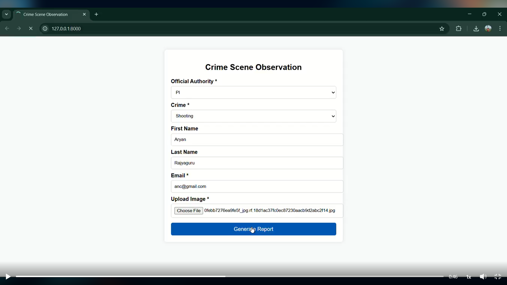
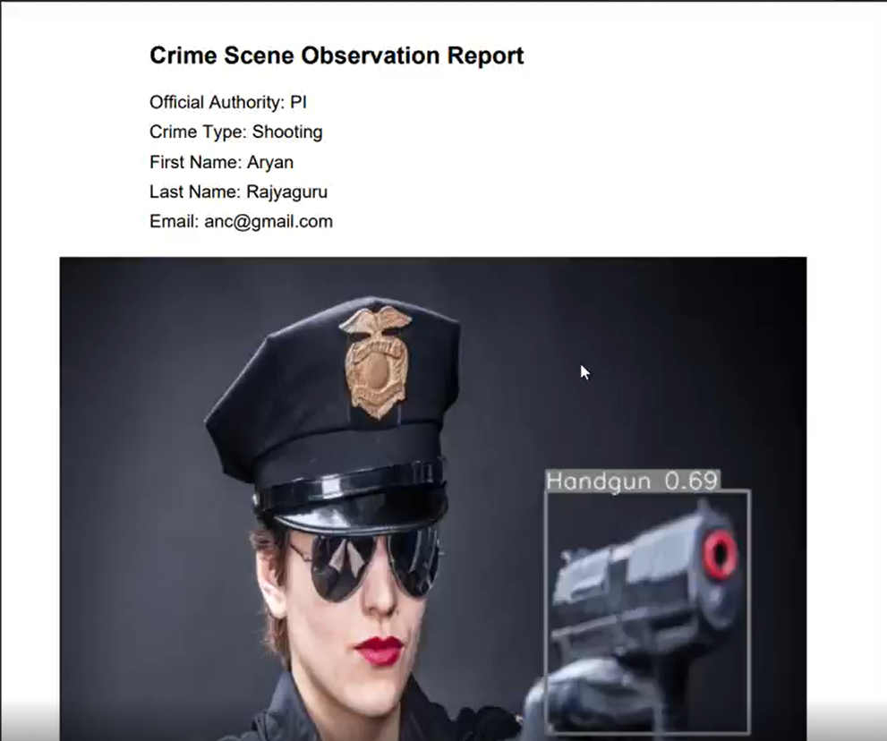

# Crime Scene Object Detection & Automated Report Generation
 
> Custom YOLOv8 forensic object detector with NLP-powered automated reporting  
> `Python` `YOLOv8` `OpenCV` `NLP` `PyTorch` `Object Detection`
 
---
 
## 🎯 Problem
 
Forensic investigators manually review crime scene images to identify weapons, evidence, and suspicious items — then write reports by hand. This is slow, subjective, and creates documentation backlogs in active investigations.
 
---
 
## 💡 Solution
 
An AI pipeline that does two things automatically:
 
1. **Detects objects** in crime scene images using a custom-trained YOLOv8 model
2. **Generates a structured forensic report** from detection results using NLP
 
No manual annotation of findings. No manual report writing.
 
---

## 🔬 Model Details
 
### Object Detection — YOLOv8 (Custom Trained)
- **Not a generic pretrained model** — trained specifically on forensic domain imagery
- Detects: weapons, evidence items, suspicious objects
- Multiple training iterations with accuracy improvements across rounds
- Built on the YOLOv8 architecture for real-time capable inference
 
### Report Generation — NLP Pipeline
- Processes detection results (class, confidence, bounding box) into structured text
- Outputs formatted forensic investigation reports automatically
- Eliminates the manual documentation bottleneck for analysts
 
---

## 🏗️ Pipeline
 
```
Crime Scene Image
       │
       ▼
┌─────────────────┐
│  YOLOv8 Model   │  ←── Custom trained on forensic imagery
│  (Detection)    │
└────────┬────────┘
         │  Detection results (objects, confidence scores, locations)
         ▼
┌─────────────────┐
│  NLP Pipeline   │  ←── Converts detections to structured language
│  (Reporting)    │
└────────┬────────┘
         │
         ▼
  Forensic Report (automated)
```
 
---
## 🚀 Features

✅ AI-based crime scene documentation</br >
✅ Image processing for enhanced evidence capture</br >
✅ YOLO object detection integration</br >
✅ Automated report generation for legal use</br >
✅ Collaboration tools for investigators</br >
✅ Real-time insights and analytics</br >
✅ Ensures legal accuracy and integrity of evidence</br >

---

## 💻 Tech Stack

| Component | Technology |
|---|---|
| Object Detection | YOLOv8 · PyTorch |
| Image Processing | OpenCV · Python |
| Report Generation | NLP · Python |
| Data Processing | Pandas · NumPy |
| Visualization | Matplotlib |
---

---


## 🛠️ Installation & Setup

1. **Clone the repository**

   ```bash
   git clone https://github.com/aryanrajyaguru22/Crime_Scene.git
   cd Crime_Scene
   ```

2. **Create a virtual environment**

   ```bash
   python -m venv venv
   # On Windows
   venv\Scripts\activate
   # On Linux/Mac
   source venv/bin/activate
   ```

3. **Install lightweight dependencies**

   ```bash
   pip install -r requirements.txt
   ```


4. **Run the application**

   ```bash
   python manage.py runserver
   ```

---


## 📊 Sample Output

<br />
<br />

---

## 👨‍💻 Contributors

✨ **Aryan Rajyaguru** - [GitHub](https://github.com/aryanrajyaguru22)</br >
✨ **Princy Patel** - [GitHub](https://github.com/Princy9114)</br >
✨ **Mahek Patel** - [GitHub](https://github.com/MahekPatel11)</br >
✨ **Umang Jadeja** - [GitHub](https://github.com/umang2640)</br >

---

## 📄 License

This project is licensed under the MIT License - see the [LICENSE](LICENSE) file for details.

---

## 🌟 Show your support

If you find this project useful, give it a ⭐ to help others discover it!
